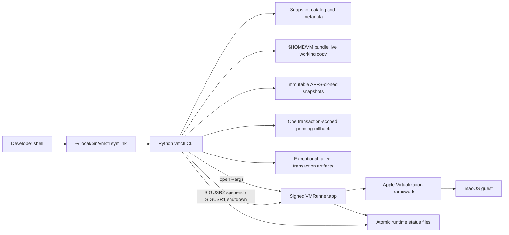

# Design: macOS VM Control

## Overview

`vmctl` will provide a shell-first management experience for the existing macOS VM. It separates the immutable snapshot catalog from the disposable live VM at `$HOME/VM.bundle`, stages a signed graphical VM runner outside Xcode DerivedData, and exposes lifecycle, snapshot, branching, base, bounded transaction recovery, diagnostics, installation, and help workflows through one command.

The implementation has two runtime pieces:

1. A dependency-free Python 3 command-line application that validates state, manages metadata, performs transactional APFS clones and moves, launches the runner, and provides help.
2. A small Swift/AppKit runner that owns the `VZVirtualMachine`, displays `VZVirtualMachineView`, saves/restores suspended state, and accepts local suspend and guest-shutdown requests.

The runner is built and Apple Development-signed once during setup. Normal `vmctl` commands do not open Xcode or invoke `xcodebuild`. The existing development identity, `Example Signing Identity`, is valid, and the staged runner must retain the `com.apple.security.virtualization` entitlement. This is a local-development workflow; distribution signing and notarization are out of scope.

Apple exposes `VZVirtualMachine.canRequestStop` and `requestStop()` for asking the guest operating system to shut down. The runner will use those APIs for `vmctl shutdown`: [VZVirtualMachine](https://developer.apple.com/documentation/virtualization/vzvirtualmachine).

### Design goals

- Make common operations memorable and available from any working directory.
- Keep every named snapshot independently loadable.
- Present logical snapshot branches without creating dependent delta chains.
- Never boot or modify a stored snapshot directly.
- Preserve the previous live VM only while a load or reset transaction is uncommitted.
- Permanently delete snapshots when the user runs `vmctl remove`.
- Avoid retaining successful-operation rollback bundles.
- Make routine failures explain what happened and what command to run next.

### Non-goals

- Managing multiple concurrently running macOS VMs.
- Installing macOS restore images.
- Remote VM control or multi-user access.
- Automatic deletion of exceptional failed-transaction artifacts.
- Distribution, notarization, or App Store packaging.

## Architecture



### One-time setup path

1. Build the Swift runner with SwiftPM from project-owned source.
2. Stage `VMRunner.app` under `app/` with an explicit `Info.plist` and entitlements.
3. Sign it with the existing Apple Development identity and hardened runtime.
4. Verify the signature and `com.apple.security.virtualization` entitlement.
5. Register the existing `initial` snapshot as the initial catalog root and base.
6. Atomically create `$HOME/.local/bin/vmctl` as a symlink to the project-local executable.
7. Run `vmctl doctor` and the automated tests.

### Normal runtime path

- `vmctl start` launches the staged app using `/usr/bin/open -n --arch arm64 ... --args` and waits for a valid runtime status record.
- `vmctl stop` sends `SIGUSR2`. The runner asks AppKit to terminate, pauses the VM, writes `SaveFile.vzvmsave`, and exits.
- `vmctl shutdown` sends `SIGUSR1`. The runner checks `canRequestStop`, calls `requestStop()`, records whether the request was accepted, and exits after the guest stops.
- Snapshot/catalog operations run only after lifecycle guards and transaction locking succeed.

### Key decisions

| Decision | Rationale |
| --- | --- |
| Python standard-library CLI | The command surface, metadata, transactions, help, and tests are safer and more maintainable than a large shell script, with no third-party dependency. |
| SwiftPM AppKit runner | It removes dependence on the downloaded Xcode sample and NIB while retaining a native graphical `VZVirtualMachineView`. |
| Signed staged `.app` | Virtualization requires the entitlement; a raw Swift executable is not a reliable graphical or signed runtime artifact. |
| Signals plus atomic status files | Local signals provide a dependency-free control channel; status files let the CLI distinguish accepted, rejected, timed-out, and stale requests. |
| APFS `clonefile` through `/bin/cp -a -c` | Snapshots and working copies begin as copy-on-write clones while remaining complete, independently loadable directory trees. |
| Logical parent metadata | Users get a familiar tree and branching experience without parent-file dependencies. |
| Base pointer, not merged disk | Promotion is atomic and reversible; resetting clones the selected immutable base into the live working path. |
| Bounded rollback | The prior live bundle exists only until a load/reset commits; successful operations do not accumulate backups. |
| Permanent snapshot removal | `remove` means deletion. Path containment, symlink, base, and live-source guards protect unrelated or active data. |
| Exceptional recovery only | `recovery/failed` is reserved for cases where automatic rollback or cleanup cannot complete safely. |

## Components and Interfaces

### 1. Project-local `vmctl` executable

The top-level `vmctl` file is an executable Python entry point. `$HOME/.local/bin/vmctl` points to it, so relative project paths are resolved from the script’s real path rather than the caller’s working directory.

Proposed internal modules:

- `src/vmctl/cli.py`: parsing, dispatch, shared output, and exit codes.
- `src/vmctl/config.py`: default paths and explicit environment overrides.
- `src/vmctl/lifecycle.py`: runner launch, process verification, suspend, shutdown, and status.
- `src/vmctl/store.py`: bundle validation, APFS clone operations, atomic moves, and locking.
- `src/vmctl/catalog.py`: snapshot metadata, tree construction, base pointer, and live origin.
- `src/vmctl/commands.py`: command transactions.
- `src/vmctl/helptext.py`: command and workflow help registry.
- `src/vmctl/doctor.py`: non-mutating readiness diagnostics.

Supported path overrides:

- `VMCTL_LIVE_BUNDLE`
- `VMCTL_APP_BUNDLE`
- `VMCTL_SNAPSHOT_DIR`
- `VMCTL_RECOVERY_DIR`
- `VMCTL_STATE_DIR`

The defaults remain the approved paths in the requirements.

### 2. Command interface

| Command | Behavior |
| --- | --- |
| `vmctl start` | Validate the live bundle and staged runner, reject duplicate launch, start or restore the live VM, and report readiness. |
| `vmctl stop` | Suspend the running VM, save resumable state, and close the runner. |
| `vmctl shutdown` | Ask guest macOS to shut down and wait for the runner to exit without saving suspended state. |
| `vmctl status` | Report process state, runtime state, saved-state presence, live origin, and current base. |
| `vmctl snapshot NAME` | Clone the stopped live bundle transactionally and record parent/state metadata. |
| `vmctl list` | List active snapshots. Permanently deleted snapshots are not catalog entries. |
| `vmctl tree` | Display logical lineage and synthesize `[deleted]` ancestors from surviving child metadata. |
| `vmctl load NAME` | Use a temporary rollback to replace live with a clone of the selected snapshot, commit metadata, then delete the rollback. |
| `vmctl revert NAME` | Exact alias for `load`. |
| `vmctl remove NAME [--detach-live]` | Permanently delete an eligible snapshot. The option explicitly detaches a stopped live VM from its source metadata. |
| `vmctl base` | Show the current immutable base snapshot. |
| `vmctl promote NAME` | Atomically update the base pointer after validating the snapshot. |
| `vmctl commit NAME` | Snapshot the stopped live VM and promote it; delete the newly created snapshot if promotion fails while preserving the old base. |
| `vmctl reset` | Safely load a new working clone of the current base. |
| `vmctl doctor` | Run read-only checks for platform, paths, bundle integrity, signature, entitlement, catalog, storage, and shell resolution. |
| `vmctl help [TOPIC]` | Show command or workflow help. `-h`, `--help`, and command-local `--help` are equivalent entry points. |

Snapshot names are limited to ASCII letters, numbers, periods, underscores, and hyphens; they must begin and end with an alphanumeric character. Reserved names and path separators are rejected.

### 3. Swift `VMRunner.app`

The runner is a programmatic AppKit application; it has no storyboard or NIB. It:

- Parses `--vm-bundle` and `--control-dir` arguments.
- Creates an `NSWindow` containing `VZVirtualMachineView`.
- Loads the auxiliary storage, hardware model, machine identifier, disk, boot loader, graphics, NAT network, audio, keyboard, and pointing devices from the live bundle.
- Uses Apple’s sample CPU and memory policy initially to avoid silently changing the installed VM’s established behavior.
- Starts a clean guest or restores `SaveFile.vzvmsave`.
- Writes runtime state atomically after every significant transition.
- Installs main-queue dispatch sources for `SIGUSR1` and `SIGUSR2`.
- Uses the normal AppKit termination path for suspend/save.
- Uses `canRequestStop` and `requestStop()` for guest shutdown.
- Exits when `VZVirtualMachineDelegate` reports a normal guest stop.

The app bundle identifier is `dev.vmctl.runner`. Its release entitlements contain virtualization and audio input only. `get-task-allow` is not required for the staged release runner.

### 4. Build, staging, and installation scripts

- `script/build_runner.sh` builds the release Swift product, creates `app/VMRunner.app`, writes its `Info.plist`, signs it, and verifies it.
- `script/install.sh` initializes metadata, registers the existing baseline, creates the shell-path symlink atomically, and runs `vmctl doctor`.
- `script/build_and_run.sh` is the project developer entry point. It builds and stages the runner, installs the launcher, runs automated tests, and invokes `vmctl doctor`. It does not automatically boot the stateful VM; actual lifecycle smoke tests are explicit.
- `.codex/environments/environment.toml` exposes that developer entry point through the Codex Run action after the script exists.

The installer refuses to replace `$HOME/.local/bin/vmctl` if it is a regular file or an unrelated symlink. It creates a temporary symlink and renames it into place, then verifies `command -v vmctl`.

### 5. Snapshot and load transactions

#### Snapshot

1. Acquire the exclusive lock.
2. Confirm the runner is stopped.
3. Validate snapshot name and live bundle artifacts.
4. Clone the live bundle into a unique temporary directory under `snapshots/`.
5. Validate the clone and write metadata atomically.
6. Rename the temporary directory to the final snapshot name.
7. On failure, permanently delete disposable partial data after validating its path. Move it to `recovery/failed/` and report it only when safe cleanup cannot complete.

#### Load/reset

1. Acquire the exclusive lock and confirm the runner is stopped.
2. Validate the source snapshot and available storage.
3. Clone the source into a unique temporary sibling of `$HOME/VM.bundle`.
4. Validate the temporary live clone.
5. Write `state/transaction.json` with the operation, paths, source snapshot, and `prepared` phase.
6. Move the old live bundle into `recovery/pending/<transaction-id>/VM.bundle` and update the journal to `displaced`.
7. Rename the new clone to `$HOME/VM.bundle` and update the journal to `activated`.
8. Atomically update and validate live-origin metadata, then mark the journal `committed`.
9. Permanently delete the pending rollback bundle and transaction journal.
10. If a pre-commit step fails, restore the prior live bundle automatically and delete disposable temporary data. Preserve artifacts under `recovery/failed` only if rollback or cleanup cannot complete safely.
11. Before another mutating command, reconcile any surviving journal: restore a displaced old live bundle when live is missing, or finish committed cleanup only after validating live and metadata.

#### Permanent remove

1. Acquire the exclusive lock and validate the exact snapshot name and bundle.
2. Reject the base snapshot and reject the current live source unless `--detach-live` is used while stopped.
3. Resolve the deletion target and prove it is a nonsymlink child of the configured snapshot root, never the snapshot root itself or `$HOME/VM.bundle`.
4. Print the exact path and that deletion is permanent.
5. Permanently delete the snapshot directory tree.
6. Keep surviving child metadata unchanged; `tree` synthesizes a `[deleted]` node when a parent name has no active snapshot.

#### Commit

1. Execute the snapshot transaction.
2. Validate the completed snapshot again.
3. Atomically update the base pointer.
4. If promotion fails, leave the prior base unchanged and permanently delete the new snapshot after path validation because the unchanged live VM remains its source of truth.

### 6. Help system

Help is generated from a registry shared by command parsing and tests. Each entry includes syntax, prerequisites, affected paths, state changes, safety behavior, exit conditions, examples, and next-help links.

Workflow topics are:

- `lifecycle`: start, suspend, resume, and guest shutdown.
- `snapshots`: create, list, tree, and load.
- `branching`: load an ancestor and create a child branch.
- `base`: promote, commit, reset, and base inspection.
- `recovery`: transaction journaling, automatic rollback behavior, exceptional failures, and the separately approved legacy cleanup.

Errors carry an optional help topic and next command, allowing messages such as `VM is running; run vmctl stop, then retry` without duplicating help text across commands.

## Data Models

### Project layout

```text
/path/to/macos-vm/
├── vmctl
├── src/vmctl/
├── runner/
│   ├── Package.swift
│   ├── Sources/VMRunner/
│   └── VMRunner.entitlements
├── app/
│   └── VMRunner.app                 # generated, signed, gitignored
├── snapshots/
│   └── initial/
│       ├── VM.bundle/
│       └── metadata.json
├── recovery/
│   ├── pending/<transaction-id>/      # exists only during an unfinished load/reset
│   └── failed/<timestamp>/
├── state/
│   ├── base.json
│   ├── live.json
│   ├── runtime.json
│   ├── control-response.json
│   ├── transaction.json               # exists only during an unfinished load/reset
│   └── vmctl.lock
├── script/
├── tests/
└── spec/macos-vm-control/
```

Generated app, snapshot, recovery, and runtime data are excluded from Git. Specifications, source, scripts, and tests remain reviewable.

### Snapshot metadata

```json
{
  "schemaVersion": 1,
  "name": "dev-tools-installed",
  "createdAt": "2026-07-18T22:30:00-04:00",
  "parent": "initial",
  "capturedState": "suspended",
  "bundleRelativePath": "VM.bundle"
}
```

The metadata is descriptive. Snapshot validity is established from required bundle artifacts, not by trusting metadata alone.

When a snapshot named in `parent` has been permanently deleted, the catalog retains no copy of that snapshot or its metadata. The tree renderer derives a synthetic `[deleted]` ancestor from the parent names referenced by surviving children.

### Transaction journal

```json
{
  "schemaVersion": 1,
  "id": "8c648d3f",
  "operation": "load",
  "sourceSnapshot": "dev-ready",
  "temporaryLive": "$HOME/.VM.bundle.vmctl-8c648d3f",
  "rollbackBundle": "/path/to/macos-vm/recovery/pending/8c648d3f/VM.bundle",
  "phase": "displaced",
  "startedAt": "2026-07-19T10:00:00-04:00"
}
```

Journal updates are atomic. The phases are `prepared`, `displaced`, `activated`, and `committed`. The journal is deleted only after the pending rollback has been deleted successfully.

### Base pointer

```json
{
  "schemaVersion": 1,
  "snapshot": "initial",
  "updatedAt": "2026-07-18T22:30:00-04:00"
}
```

Updates use write-to-temporary-file, `fsync`, and same-directory rename.

### Live origin

```json
{
  "schemaVersion": 1,
  "sourceSnapshot": "initial",
  "loadedAt": "2026-07-18T22:30:00-04:00",
  "detached": false
}
```

### Runtime status

```json
{
  "schemaVersion": 1,
  "pid": 12345,
  "state": "running",
  "vmBundle": "$HOME/VM.bundle",
  "updatedAt": "2026-07-18T22:31:00-04:00",
  "message": null
}
```

The CLI verifies that the PID exists and belongs to the staged runner before treating this file as current.

### Required VM artifacts

A valid bundle must contain nonempty `Disk.img`, `AuxiliaryStorage`, `HardwareModel`, and `MachineIdentifier`. `SaveFile.vzvmsave` and `RestoreImage.ipsw` are optional. Snapshot state is `suspended` when a save file exists and `shutdown` otherwise.

## Error Handling

### Exit classes

| Code | Class | Examples |
| --- | --- | --- |
| `0` | Success | Command completed or requested state already satisfied. |
| `2` | Usage | Unknown command, invalid name, missing argument. |
| `3` | State conflict | VM running during snapshot/load, duplicate launch, protected snapshot removal. |
| `4` | Artifact/configuration | Missing bundle file, invalid metadata, missing staged app. |
| `5` | Lifecycle | Launch failure, rejected shutdown, suspend/shutdown timeout. |
| `6` | Transaction | Clone, rename, metadata, promotion, or rollback failure. |
| `7` | Environment | Signing, entitlement, platform, storage, lock, or shell-path failure. |

### Safety rules

- All mutating commands acquire an advisory `flock` lock.
- Process checks validate both PID liveness and executable identity.
- State-changing commands print affected paths.
- Snapshots are immutable after finalization.
- Permanent deletion is allowed only through a containment-checked helper for a specifically selected snapshot, transaction temporary, or approved legacy path.
- Symlink targets, path escapes, snapshot roots, the live bundle, the base, and an attached live source are rejected.
- Disposable partial clones and failed-commit snapshots are deleted after validation; only failed rollback/cleanup artifacts move to `recovery/failed`.
- The base and current live source are protected from ordinary removal.
- Base updates and metadata writes are atomic.
- A stale runtime file is reported as stale and does not block safe stopped-state operations after process verification.
- Timeouts never escalate to force-kill automatically.

## Testing Strategy

### 1. Python unit and command tests

Use `unittest`, temporary directories, fake VM bundles, and injected process/clone/signing adapters. Tests cover:

- Parsing, aliases, name validation, and all help entry points.
- Bundle validation and state classification.
- Running-state guards and stale runtime records.
- Snapshot creation, duplicates, metadata, list, and tree.
- Branch creation and loading children after parent removal.
- Live preservation, load rollback, reset, and failed activation.
- Permanent remove, base protection, live-source protection, explicit detachment, and deleted-parent tree rendering.
- Transaction journal phase transitions, successful rollback deletion, interrupted-operation reconciliation, and rollback failure preservation.
- Promote and atomic commit success/failure.
- Lock contention.
- Installer symlink creation/replacement/refusal and PATH verification.
- Doctor check aggregation.
- Help registry coverage for every command and required workflow.

### 2. Swift runner tests

Keep VM-independent logic in testable Swift types. Test argument parsing, path derivation, atomic runtime-state encoding, signal-command mapping, and shutdown-response encoding without starting a VM.

### 3. Build and signing verification

The build pipeline runs:

- `swift test`
- `swift build -c release`
- `codesign --verify --strict --deep app/VMRunner.app`
- Entitlement extraction verifying `com.apple.security.virtualization=true`
- Python test suite
- `vmctl doctor`

### 4. Real-VM smoke sequence

Run serially against the existing VM only after unit tests pass and the current live state has an explicit named snapshot when preservation is desired:

1. Confirm `initial` and record the original base/live metadata.
2. Verify `status`, `doctor`, shell resolution, and all help indexes.
3. Start the VM, verify the runner/runtime state, then stop and verify saved state.
4. Start again, request guest shutdown, verify process exit and absence of saved state.
5. Reset from the baseline so subsequent tests do not depend on shutdown changes.
6. Create temporary snapshots, list/tree them, load an ancestor, and create a branch.
7. Permanently remove a nonprotected temporary snapshot and verify its bundle is absent while its child remains independently loadable.
8. Promote a temporary snapshot, reset from it, then restore the original base.
9. Commit a temporary live state, verify the new base, and restore the original base.
10. Return the live VM to the intended source, permanently remove test snapshots, and verify `recovery/pending` and the transaction journal are absent.

Every live test records before/after paths and stops immediately on an unexpected state. Permanent deletion is limited to uniquely named snapshots created by the smoke test.

### 5. Legacy recovery migration

The existing `recovery/live` and `recovery/removed` directories predate this design. Migration is separate from installation and normal commands:

1. An inventory-only script lists exact candidate paths, entry counts, logical sizes, and current `df` free space without deleting data.
2. Execution requires explicit approval of the candidate set and refuses to run while the VM runner is active.
3. The first pass deletes the five approved legacy removed snapshots and all legacy live backups except the newest one.
4. After the new transaction model passes unit and real-VM load/reset tests, a second explicit approval deletes the final retained legacy live backup.
5. The migration reports `df` before and after; it does not claim that logical `du` size equals physically reclaimed APFS space.

## Requirements Traceability

| Requirements | Design coverage |
| --- | --- |
| 1.1–1.7 | Runner lifecycle, signals, runtime status, start/stop/shutdown interfaces. |
| 2.1–2.10 | Snapshot transaction, metadata, independent clones, list/tree. |
| 3.1–3.9 | Journaled load/reset transaction, temporary rollback cleanup, interruption reconciliation, branching metadata. |
| 4.1–4.10 | CLI structure, staged app, installer, PATH symlink, path configuration. |
| 5.1–5.5 | Validation, locking, path-contained deletion, rollback safety, exit classes. |
| 6.1–6.4 | Unit adapters, doctor, installer and PATH tests. |
| 7.1–7.16 | Permanent remove, deleted-parent lineage, base pointer, promote, commit, reset, legacy migration, protections. |
| 8.1–8.15 | Help registry, workflow topics, command coverage, next-action errors. |
