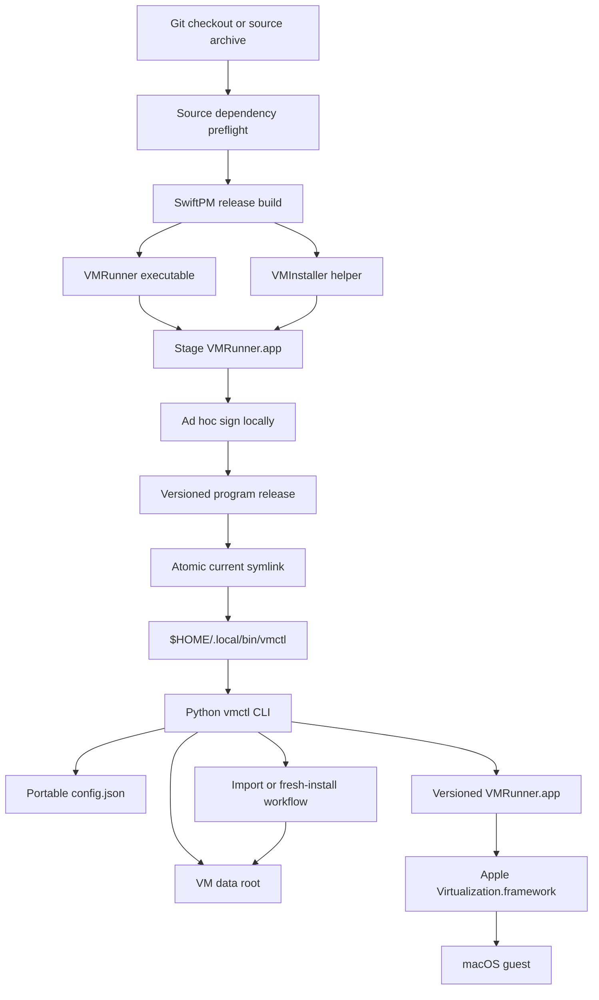

# Design: Public Release and Turnkey Distribution

## Overview

The public-release work converts the existing machine-specific `vmctl` checkout into one portable source project that developers can clone, build, install, initialize, and operate without opening Xcode or creating a signing certificate.

The first public release is source-first:

1. The user clones or downloads the repository.
2. The user runs `./script/install-from-source.sh`.
3. The installer performs a non-mutating dependency preflight.
4. SwiftPM builds the native runner and installation helper.
5. The build stages a local app bundle and ad hoc signs it with Hardened Runtime and the required entitlements.
6. Versioned program files are installed under the user's Application Support directory.
7. A stable launcher is created under `$HOME/.local/bin`.
8. `vmctl init` guides the user through importing an existing VM or installing macOS from an Apple restore image.
9. `vmctl doctor` verifies the resulting installation.

Python 3.10 or newer is an explicit source-install runtime dependency for this first release. Apple Command Line Tools for Xcode are sufficient when they provide Swift 6 and a compatible macOS SDK. The workflow does not create an Xcode project, invoke `xcodebuild`, open Xcode, select a development team, create a certificate, or alter Keychain trust.

A future prebuilt channel is designed separately. It uses a self-contained CLI, Developer ID signing, notarization, and Gatekeeper validation. That channel remains disabled until the maintainer explicitly supplies protected release credentials and separately approves publication. The absence of those credentials does not block the source release.

The existing lifecycle and snapshot contracts remain authoritative. Public-release changes replace machine-specific configuration and installation assumptions without weakening immutable snapshots, permanent removal, bounded rollback, independent children, or exceptional-only recovery.

## Research Decisions

### Command-line developer tools

Apple documents Command Line Tools for Xcode as an alternative to full Xcode and states that the package contains the macOS SDK and toolchain binaries used for command-line development. The project therefore requires a compatible selected developer directory, Swift 6, SwiftPM, and a macOS 26-or-newer SDK, but not the Xcode UI or `xcodebuild`.

Reference: [Installing the command-line tools](https://developer.apple.com/documentation/xcode/installing-the-command-line-tools/)

### Virtualization entitlement

Apple requires the process using Virtualization.framework to carry `com.apple.security.virtualization`. Source builds therefore receive an ad hoc signature that embeds the entitlement. Strict signature and entitlement inspection are source-build acceptance gates even though an ad hoc signature is not a public Gatekeeper trust identity.

Reference: [Adding the Virtualization Entitlement to Your Project](https://developer.apple.com/documentation/virtualization/adding-the-virtualization-entitlement-to-your-project)

### Fresh macOS installation

Fresh initialization uses `VZMacOSRestoreImage` to obtain compatible requirements, creates unique platform artifacts, constructs the VM configuration, and uses `VZMacOSInstaller` with a local restore image. The project downloads restore images only from a URL returned by Apple's API or uses a user-supplied local IPSW.

Reference: [Installing macOS on a Virtual Machine](https://developer.apple.com/documentation/virtualization/installing-macos-on-a-virtual-machine)

### Apple sample-code provenance

The existing Swift runner was adapted from Apple's “Running macOS in a virtual machine on Apple silicon” sample. The current Apple archive includes an MIT license with an Apple copyright notice and requires that notice and permission text to accompany copies or substantial portions of the sample.

The public repository therefore:

- Does not fetch Apple sample source during installation or build.
- Records the exact official sample URL, archive checksum, retrieval date, and adapted file set in `THIRD_PARTY_NOTICES.md`.
- Includes the unmodified Apple sample license in `LICENSES/Apple-Sample-Code-MIT.txt`.
- Marks adapted Swift files with a short provenance comment pointing to the third-party notice.
- Applies the project's MIT license to project-owned work without removing or replacing Apple's notice for adapted portions.
- Treats required copyright and license notices as approved attribution, not as prohibited personal information.
- Avoids Apple names, marks, or sample artwork in project branding and does not imply Apple affiliation or endorsement.

The implementation performs a file-by-file comparison against the current official archive before publication. If an adapted portion cannot be tied to the reviewed MIT-licensed archive, it is replaced with an independently implemented equivalent based on public framework documentation or retains every applicable historical Apple notice. Publication does not rely on an unknown older sample's licensing terms.

References:

- [Running macOS in a virtual machine on Apple silicon](https://developer.apple.com/documentation/virtualization/running-macos-in-a-virtual-machine-on-apple-silicon)
- [Current Apple sample archive](https://docs-assets.developer.apple.com/published/c8bf24264607/RunningMacOSInAVirtualMachineOnAppleSilicon.zip)

### Apple software and SDK boundary

The repository and every release archive contain project source and project-built artifacts only. They never contain or mirror an IPSW, installed macOS VM, Apple SDK, Apple framework, Apple binary, Xcode component, restore-image cache, VM firmware artifact, or guest credential.

Source builds compile against the user's locally installed macOS SDK and dynamically use the system Virtualization framework. Fresh initialization downloads a restore image directly from an Apple-provided URL into the user's local cache after explicit confirmation. The project documentation requires users to comply with the macOS license applicable to the guest version and states the Apple-branded-host and permitted-virtualization boundaries without offering legal advice.

### Public binary trust

Directly distributed binaries require Developer ID signing, Hardened Runtime, secure timestamps, and notarization. Apple accepts ZIP archives for notarization, but the ZIP itself cannot be stapled; nested apps are stapled before the final distribution ZIP is created. Release signing is therefore isolated from untrusted pull-request builds.

References:

- [Notarizing macOS software before distribution](https://developer.apple.com/documentation/security/notarizing-macos-software-before-distribution)
- [Customizing the notarization workflow](https://developer.apple.com/documentation/security/customizing-the-notarization-workflow)

## Goals

- Provide one repository and one source-install entry point.
- Require no certificate or Apple developer membership for a local source build.
- Keep full Xcode optional and eliminate Xcode UI steps.
- Preserve the user's existing VM data during installation, update, and migration.
- Make a new VM install and existing VM import discoverable and transactional.
- Separate immutable program releases from mutable VM data.
- Remove personal and machine-specific values from every tracked file.
- Preserve and clearly scope required Apple sample-code attribution.
- Keep Apple operating-system media, SDKs, frameworks, binaries, and VM artifacts outside source and release archives.
- Produce a professional, testable public repository before any external publication.
- Define but do not prematurely enable the Developer ID binary-release channel.

## Non-goals

- Supporting Intel Macs.
- Managing multiple concurrently running VMs in the initial public release.
- Bundling macOS, an IPSW, or an installed VM.
- Creating, installing, or trusting certificates on a user's behalf.
- Disabling or bypassing Gatekeeper, SIP, or other macOS protections.
- Providing a prebuilt binary before Developer ID and notarization credentials are explicitly available.
- Adding telemetry, analytics, remote control, or host-to-guest clipboard integration.
- Automatically moving or deleting an existing installation's VM data.

## Architecture



The installed system has four boundaries:

1. **Source tree**: reviewable code, tests, specifications, documentation, and scripts.
2. **Program releases**: immutable, versioned copies of the Python CLI and signed Swift app.
3. **Mutable data**: configuration, live VM, snapshots, state, recovery, and logs.
4. **Shell launcher**: one stable symlink that follows the active program release.

## Distribution Model

### Initial source release

The initial GitHub release contains only tracked source and documentation. GitHub's tagged source archive is sufficient because `install-from-source.sh` performs compilation and installation. Users need:

- Apple silicon.
- macOS 26 or newer for the initial validated source release.
- APFS for the managed VM data location.
- Python 3.10 or newer.
- Swift 6 and a compatible macOS SDK from Command Line Tools or full Xcode.
- Enough storage for the selected import or installation operation.

The source release is versioned and checksummed, but it is not described as a notarized binary.

### Future binary release

The future binary release uses a separate trusted workflow:

- Build the Swift runner and helper.
- Package the Python CLI as a self-contained arm64 executable using a pinned, reviewed bundler selected during that release milestone.
- Sign every nested Mach-O item from the inside out.
- Sign the app and CLI with Developer ID Application, Hardened Runtime, and secure timestamps.
- Notarize the ZIP.
- Staple the ticket to `VMRunner.app`.
- Recreate the final ZIP containing the stapled app.
- Verify signatures, entitlements, Gatekeeper assessment, notarization ticket, archive contents, and checksums on a clean Mac.

The source-release implementation does not introduce a Python bundler dependency. This avoids expanding the trusted supply chain before a prebuilt channel is authorized.

## Portable Filesystem Layout

The default user-scoped layout is:

```text
$HOME/
├── .local/bin/
│   └── vmctl -> $HOME/Library/Application Support/vmctl/current/bin/vmctl
└── Library/
    ├── Application Support/vmctl/
    │   ├── VERSION
    │   ├── config.json
    │   ├── install-manifest.json
    │   ├── current -> releases/<version>
    │   ├── releases/
    │   │   └── <version>/
    │   │       ├── bin/vmctl
    │   │       ├── lib/vmctl/
    │   │       ├── libexec/VMRunner.app
    │   │       └── release.json
    │   └── data/
    │       ├── live/VM.bundle
    │       ├── snapshots/<name>/
    │       ├── recovery/
    │       │   ├── pending/
    │       │   └── failed/
    │       └── state/
    ├── Caches/vmctl/
    │   ├── builds/
    │   └── restore-images/
    └── Logs/vmctl/
```

Program releases and mutable data are siblings, never nested. Switching `current` cannot overwrite `data`.

Environment overrides remain supported. Configuration resolution order is:

1. Explicit command-line option.
2. Existing `VMCTL_*` environment override.
3. Installed `config.json`.
4. Portable default derived from `Path.home()`.

Tracked code contains no absolute personal path. Generated local configuration may contain resolved absolute paths because it is excluded from Git and release artifacts.

## Components and Interfaces

### 1. Source preflight

`script/install-from-source.sh` begins with shell-only checks so it can explain a missing Python runtime. Once Python 3.10+ is confirmed, it delegates richer validation to `python3 -m vmctl.preflight`.

Checks:

- `uname -m` is `arm64`.
- Host macOS is at least 14.
- `xcode-select -p` resolves.
- `xcrun --find swift` resolves.
- Swift is at least version 6.
- `xcrun --show-sdk-path` resolves a macOS SDK supporting the package deployment target.
- Python is at least 3.10.
- `/usr/bin/codesign`, `/usr/bin/xattr`, `/bin/cp`, and `/usr/bin/open` exist.
- The configured data volume is APFS.
- Program, cache, launcher, and data paths are writable or safely creatable.
- Required free space is available for the selected operation.
- The launcher path is absent, already managed by this installation, or explicitly overridden.

Missing Command Line Tools produces an actionable message containing:

```bash
xcode-select --install
```

The installer stops without writing program or data files and instructs the user to rerun it after the Apple installer completes.

Preflight output uses `PASS`, `WARN`, `FAIL`, and `NEXT` records. A failure produces one smallest corrective action and a nonzero exit.

### 2. Versioned source installation

`script/install-from-source.sh` orchestrates:

1. Preflight.
2. Python tests.
3. Swift tests.
4. Swift release build.
5. App staging and signing.
6. Staged-release validation.
7. Copy into a unique temporary release directory.
8. Atomic rename to `releases/<version>`.
9. Atomic `current` symlink replacement.
10. Stable launcher installation.
11. Installed `vmctl doctor`.
12. Guided initialization when no configuration exists and the terminal is interactive.

If the release directory already exists and its manifest matches, installation is idempotent. If it differs, installation refuses to overwrite it and instructs the user to use a new version or remove only the unreferenced program release.

The installed `bin/vmctl` is a generated launcher that records the absolute Python interpreter validated during installation and resolves the adjacent installed Python modules. This generated local value is not tracked. Every invocation rechecks that the interpreter still satisfies Python 3.10+ and prints reinstall guidance if it does not.

### 3. Swift package products

`runner/Package.swift` contains:

- `VMRunnerCore`: VM-independent configuration and record types.
- `VMRunner`: AppKit graphical VM runner.
- `VMInstallerCore`: restore-image, artifact, and progress-record types.
- `VMInstaller`: command-line installation helper using Virtualization.framework.
- Unit-test targets for both core libraries.

`VMInstaller` is installed at:

```text
VMRunner.app/Contents/Helpers/VMInstaller
```

It is signed before the outer app because it is nested executable code.

### 4. App staging and signing modes

`script/build_runner.sh` accepts:

```text
--signing adhoc
--signing development --identity <identity>
--signing developer-id --identity <identity>
```

Defaults:

- Source install: `adhoc`.
- Contributor override: `development`.
- Trusted release workflow only: `developer-id`.

Ad hoc signing uses identity `-`, Hardened Runtime, no timestamp, and explicit entitlements. It neither queries nor modifies Keychain.

Development signing requires an explicit identity and verifies it through `security find-identity`. It does not infer or store a personal identity.

Developer ID signing requires an explicit identity, secure timestamp, release-only entitlements, and protected workflow context.

Signing proceeds:

1. Build and stage all files.
2. Remove extended attributes only from the unique generated staging directory.
3. Sign `Contents/Helpers/VMInstaller`.
4. Sign `VMRunner.app`.
5. Run strict verification.
6. Extract and compare entitlements.
7. Reject `get-task-allow`.
8. Verify version and bundle identifiers.

`--deep` is used for verification, not as the signing strategy.

Launch-time code never deletes `com.apple.quarantine` or other trust metadata. A source build may clear inherited extended attributes only inside its newly created staging directory before signing. An installed artifact with unexpected quarantine or an invalid signature fails closed with rebuild or reinstall guidance.

Strict validation parses the entitlement property list and compares exact keys and Boolean values. It requires `com.apple.security.virtualization=true`, permits audio input only when the documented audio-input feature is enabled, and rejects `get-task-allow` and every unapproved entitlement. String searches for an entitlement key and an unrelated `<true/>` value are not accepted as proof.

Stable identifiers:

- Runner: `dev.vmctl.runner`
- Installer helper: `dev.vmctl.installer`
- CLI signing identifier for a future binary: `dev.vmctl.cli`

### 5. Version contract

A root `VERSION` file is the single source version. Build scripts populate:

- Python `vmctl.__version__`.
- Runner `CFBundleShortVersionString`.
- Runner build number.
- Installed `release.json`.
- `vmctl --version`.
- `VMRunner --version`.
- `VMInstaller --version`.

The CLI and runner exchange protocol version `1`. `vmctl start` rejects an incompatible runner before launch and identifies the repair command.

### 6. Portable configuration

`config.json` stores only installation-specific paths and behavior:

```json
{
  "schemaVersion": 1,
  "programVersion": "0.1.0",
  "dataRoot": "$HOME/Library/Application Support/vmctl/data",
  "liveBundle": "$HOME/Library/Application Support/vmctl/data/live/VM.bundle",
  "snapshotDirectory": "$HOME/Library/Application Support/vmctl/data/snapshots",
  "recoveryDirectory": "$HOME/Library/Application Support/vmctl/data/recovery",
  "stateDirectory": "$HOME/Library/Application Support/vmctl/data/state",
  "runnerApplication": "$HOME/Library/Application Support/vmctl/current/libexec/VMRunner.app"
}
```

The example uses `$HOME` for documentation. The actual generated file stores resolved local paths and is never published.

Writes use a temporary sibling, `fsync`, and rename. Unknown schema versions fail read-only with upgrade guidance.

### 7. Initialization command

New interface:

```text
vmctl init
vmctl init import PATH [--mode clone|adopt] [--base NAME] [--discard-saved-state]
vmctl init install [--restore latest|PATH] [--disk-size SIZE] [--base NAME]
```

Interactive `vmctl init` explains both choices and recommends `clone` for import.

#### Import clone

1. Validate the source bundle without writing it.
2. Reject suspended state by default because Virtualization.framework saved
   state may not restore across runner builds. Permit
   `--discard-saved-state` only in clone mode and remove it only from the
   staged clone after confirmation.
3. Verify destination and storage.
4. Print source, destination, copy mode, saved-state behavior, and initial base.
5. Require confirmation.
6. APFS-clone into a unique staging directory.
7. Add or validate a per-VM network identity.
8. Validate the staged live bundle.
9. Create the initial immutable base snapshot.
10. Commit configuration and catalog metadata atomically.
11. Leave the source bundle untouched.

#### Import adopt

Adopt is an advanced option. It prints that the selected source becomes the managed writable live VM. After confirmation, it writes configuration pointing to that path and creates the initial base snapshot under the managed snapshot root. It does not rename or copy the live source.

#### Fresh install

1. Resolve `latest` through Apple's restore-image API or validate a local IPSW.
2. Display source URL or local path, expected download size when available, cache path, VM destination, disk allocation, and required free space.
3. Download to a `.partial` cache file and atomically rename after validation.
4. Ask `VMInstaller` for supported hardware and minimum CPU/memory requirements.
5. Create a unique staging VM bundle.
6. Create disk, auxiliary storage, machine identifier, hardware model, and network identity.
7. Run `VZMacOSInstaller` and publish structured progress.
8. Validate the installed bundle.
9. Atomically activate it as live.
10. Create the initial base snapshot and commit metadata.
11. Remove the cached IPSW by default only after successful installation; retain it only when `--keep-restore-image` was selected.

The default disk is a documented 128 GiB sparse image, subject to the restore image's requirements and an explicit user override.

### 8. Per-VM network identity

The fixed source-controlled MAC address is removed.

New and imported VMs receive a `NetworkMACAddress` artifact containing a validated locally administered unicast address. It is copied with the VM bundle and therefore remains stable across live clones and snapshots.

For a legacy bundle without this artifact, initialization derives a deterministic address from the machine identifier, writes it only to a staging clone or after explicit adoption approval, and records the action. The runner can derive the same value read-only for pre-migration diagnostics but does not silently mutate a running VM.

### 8a. Local filesystem and process trust

Mutable VM data is private to the installing account by default:

- Data, live, snapshot, recovery, state, cache, and log directories use mode `0700`.
- Configuration, state, journals, manifests, network identities, and diagnostic records use mode `0600`.
- VM bundle files use the narrowest mode compatible with Virtualization.framework and are not group- or world-readable.
- Program directories and executables remain readable/executable as required but contain no VM or guest data.
- Installation validates and repairs overly broad permissions only inside paths recorded as managed by `vmctl`; an imported or adopted external bundle receives a preview before any permission change.

Bundle validation rejects symlinked roots, symlinked required artifacts, nonregular required artifacts, path escapes, and unexpected ownership where it would cross the current user's trust boundary. Snapshot catalog enumeration does not follow symlinked directories. Metadata is schema-validated, its snapshot name must equal its containing directory, and displayed values must be bounded printable text so hostile metadata cannot inject terminal controls or redirect filesystem operations.

Runtime process control validates the PID, effective user, and canonical executable path against the installed `VMRunner` immediately before every signal. A process whose basename merely equals `VMRunner` is not sufficient. Stale, malformed, symlinked, overly permissive, or mismatched runtime records are rejected and never authorize signaling another process.

### 9. Existing-installation migration

New interface:

```text
vmctl migrate plan [--legacy-root PATH] --output MANIFEST
vmctl migrate apply --manifest MANIFEST --approve-digest DIGEST
```

The safest migration is configuration adoption: keep existing VM data in place and install only portable program files. The plan shows:

- Current program source.
- Live VM.
- Snapshot, recovery, and state roots.
- New program paths.
- Whether data stays in place or is cloned.
- Expected writes.
- Expected logical storage.
- Protected paths.
- Candidate digest.

`apply` refuses changed manifests, a running VM, pending transactions, symlinks, path escapes, or insufficient storage. Data deletion is never part of migration. Old data cleanup remains a separate explicit user action after the new installation is validated.

### 10. Upgrade and uninstall

Upgrade installs a new immutable program release and atomically switches `current`. It does not rewrite configuration or data unless a schema migration was separately previewed.

Uninstall modes:

```text
vmctl uninstall
vmctl uninstall --purge-data --approve-path <exact-data-root>
```

Default uninstall removes only the launcher, `current`, and installed program releases recorded in `install-manifest.json`. It preserves configuration, live VM, snapshots, recovery, state, and logs.

Data purge is a separately confirmed permanent operation that requires the exact canonical data root and uses the containment-checked deletion primitive.

### 11. Diagnostics and redaction

`vmctl doctor` adds:

- Installation version and source/binary channel.
- Python path and version for source installations.
- Swift/toolchain checks only when source build capability is requested.
- Runner signing class: ad hoc, Apple Development, or Developer ID.
- Runner/CLI protocol compatibility.
- Config schema.
- Data volume and APFS status.
- Initialization state.

`vmctl doctor --share` replaces the home directory with `$HOME`, removes usernames and VM names where unnecessary, excludes guest information, and never emits credentials or full signing identities.

Ordinary diagnostics may show local paths to the current user. Share-mode output, smoke-test reports, CI logs, failure journals, and issue templates use the same redaction library. Errors originating in system frameworks are treated as untrusted text and are stripped of home paths, signing identities, VM names, and terminal-control characters before they are marked shareable.

### 12. Repository hygiene

`script/check_release_hygiene.py` scans only tracked files and a generated source archive. It fails on:

- Personal absolute home paths.
- Configured prohibited names or identifiers.
- Personal email addresses outside approved attribution files.
- Apple team, certificate, provisioning-profile, or private-key material.
- VM bundles and artifacts.
- IPSWs, disk images, saved-state files, local app bundles, build caches, and runtime state.
- Files above the approved source-size threshold.
- Broken or escaping symlinks.

`.gitignore` adds defense-in-depth patterns for VM and release secrets anywhere in the checkout, while the hygiene checker protects against force-add mistakes.

Defense-in-depth patterns cover, at minimum:

- `VM.bundle`, `*.ipsw`, `Disk.img`, `AuxiliaryStorage`, `HardwareModel`, `MachineIdentifier`, `NetworkMACAddress`, and `*.vzvmsave`.
- Generated `.app` bundles, Swift/Python build products, caches, runtime state, manifests containing resolved local paths, and logs.
- `.env*`, private keys, certificate/key archives, provisioning profiles, notarization profiles, and temporary keychains.

The checker permits the exact reviewed Apple copyright and license text only in approved attribution files and provenance comments. It rejects personal signing subjects, team identifiers, repository-specific owner names, local snapshot names, personal Git author metadata in the public commit range, and personal strings embedded in generated Mach-O or archive contents.

The public repository contains:

- `README.md`
- `LICENSE` using the MIT license, subject to design approval
- `LICENSES/Apple-Sample-Code-MIT.txt`
- `THIRD_PARTY_NOTICES.md`
- `SECURITY.md`
- `CONTRIBUTING.md`
- `CODE_OF_CONDUCT.md`
- `CHANGELOG.md`
- Issue and pull-request templates
- CI and source-release workflows
- Approved specifications

Existing specifications, tests, help text, fixtures, and scripts are sanitized as part of the same change; specifications are not exempt from the PII gate.

### 13. CI and release workflows

#### Pull-request CI

Runs on a supported macOS runner with read-only default permissions:

- Hygiene scan.
- ShellCheck with warnings treated as failures.
- Python 3.10+ unit tests.
- Swift tests.
- Swift release build.
- Ad hoc app staging.
- Strict signature and entitlement verification.
- Temporary-home install, upgrade, init-import, migration, and uninstall tests.
- Generated source-archive inspection.

Fork pull requests receive no secrets.

#### Source release

A version-tag workflow:

1. Repeats all CI gates.
2. Generates a source archive from tracked files.
3. Scans archive contents.
4. Generates SHA-256 checksums and release notes.
5. Uploads draft release assets.

Publishing the GitHub release remains an explicit external action.

#### Future trusted binary release

The workflow is separate, manually dispatched from a reviewed tag, environment-protected, and unavailable to pull requests. It imports Developer ID material into an ephemeral keychain, signs nested code, notarizes, staples, validates, deletes the keychain, and produces a draft artifact. Publication still requires explicit approval.

## Data Models

### Release manifest

```json
{
  "schemaVersion": 1,
  "version": "0.1.0",
  "channel": "source",
  "pythonMinimum": "3.10",
  "runnerProtocol": 1,
  "bundleIdentifier": "dev.vmctl.runner",
  "signingMode": "adhoc",
  "installedAt": "2030-01-02T03:04:05Z"
}
```

### Install manifest

```json
{
  "schemaVersion": 1,
  "activeVersion": "0.1.0",
  "launcher": "$HOME/.local/bin/vmctl",
  "managedProgramRoots": [
    "$HOME/Library/Application Support/vmctl/releases/0.1.0"
  ],
  "dataRoot": "$HOME/Library/Application Support/vmctl/data"
}
```

The uninstall operation may remove only paths listed as managed program roots after containment validation. `dataRoot` is informational and protected by default.

### Initialization journal

```json
{
  "schemaVersion": 1,
  "id": "example-transaction-id",
  "operation": "import-clone",
  "phase": "staged",
  "source": "/path/to/VM.bundle",
  "temporaryBundle": "$HOME/Library/Application Support/vmctl/data/.staging-example/VM.bundle",
  "finalBundle": "$HOME/Library/Application Support/vmctl/data/live/VM.bundle",
  "baseName": "initial"
}
```

Phases are `prepared`, `downloaded`, `artifacts-created`, `installing`, `staged`, `activated`, and `committed`; operations use only the applicable subset. Reconciliation removes validated uncommitted staging data or completes a committed metadata update. It never deletes an import source.

### Migration plan

```json
{
  "schemaVersion": 1,
  "candidateDigest": "sha256-example",
  "mode": "adopt-configuration",
  "writes": [
    "$HOME/Library/Application Support/vmctl/config.json"
  ],
  "protectedSources": [
    "/path/to/existing/VM.bundle",
    "/path/to/existing/snapshots"
  ],
  "deletions": []
}
```

## Failure Handling

### Preflight

- Missing Python: stop before Python code and print the required version.
- Missing developer tools: print `xcode-select --install`, stop, and request rerun.
- Swift or SDK too old: print detected and required versions.
- Non-APFS data destination: reject managed snapshot initialization.
- Insufficient storage: print required, available, and calculation basis.

### Build and signing

- Build failure leaves the active installation unchanged.
- Staging occurs outside the active release.
- Signature or entitlement mismatch prevents installation.
- Ad hoc signing is reported as local trust, never as public trust.
- Developer ID mode refuses missing timestamp, required identity, or release environment.

### Initialization

- Import source is read-only until explicit approval.
- New installation operates in a staging bundle.
- Interrupted downloads retain only a labeled partial cache file.
- Failed installations never appear as a configured live VM.
- Activation and metadata commits are journaled and reconciled.
- Cache cleanup never touches VM artifacts.

### Upgrade and uninstall

- Failed upgrade leaves `current` unchanged.
- Uninstall refuses unknown, escaped, or symlinked paths.
- Default uninstall cannot remove `dataRoot`.
- Purge requires exact path approval and stopped VM state.

## Security and Privacy

- No certificates are generated or trusted.
- No Keychain, Gatekeeper, SIP, or shell startup setting changes occur silently.
- Source ad hoc signing embeds only reviewed entitlements.
- Release secrets exist only in protected release environments.
- Workflows use least-privilege permissions and pinned third-party actions.
- Restore-image network access is explicit and limited to Apple-provided URLs.
- No VM, snapshot, guest, diagnostic, or configuration data is uploaded.
- No telemetry or analytics are included.
- Public diagnostics redact local identifiers.
- Generated release artifacts are built from a clean checkout or tracked-file archive.

## Testing Strategy

### Unit tests

- Portable path derivation and override priority.
- Config, install-manifest, release-manifest, and journal schemas.
- Python version parsing and dependency preflight.
- Swift/toolchain and SDK detection adapters.
- Signing-mode command construction and entitlement comparison.
- Version/protocol compatibility.
- Network identity generation and persistence.
- Import clone/adopt planning and guards.
- Fresh-install plan and progress records.
- Migration plan digest, changed-plan rejection, and no-deletion contract.
- Upgrade switching and uninstall data preservation.
- Redacted diagnostics.
- Hygiene scanner positive and negative fixtures.

### Integration tests

- Clean source install under a temporary home.
- Missing Python and missing developer-tools walkthroughs using stubs.
- Ad hoc runner build and strict signature verification.
- Optional development identity selection through a stub keychain.
- Fake-bundle import and initial base creation.
- Interrupted initialization reconciliation.
- Existing configuration adoption without data movement.
- Upgrade from one synthetic version to another.
- Default uninstall preserving data.
- Source archive generation and prohibited-artifact rejection.
- Hostile bundles containing symlinked roots or artifacts, escaped metadata, mismatched snapshot names, and terminal-control text.
- Runtime records naming a live but unrelated process, a same-name executable at the wrong path, a different owner, and a PID reused after verification.
- Private directory/file modes under a permissive test umask and safe permission migration previews for imported data.
- Launch refusal for unexpected quarantine, invalid signatures, excessive entitlements, and `get-task-allow`.
- Exact Apple license/notice presence and provenance mapping for every adapted source file.

### Swift tests

- Runner and installer argument parsing.
- Restore-image requirement records.
- Installer progress encoding.
- VM artifact path derivation.
- Network address validation.
- Version and protocol output.

### Guarded real-VM tests

The existing maintainer VM is never used automatically.

A dedicated disposable test VM validates:

1. Ad hoc source install.
2. Import clone.
3. Start and suspend.
4. Resume and shutdown.
5. Snapshot, load, reset, and permanent removal.
6. Default uninstall preserving data.

The test requires explicit `--execute`, records all affected paths, and stops on any unexpected state.

### Release validation

- Clean checkout.
- Full CI.
- PII and secret scan.
- File-by-file third-party provenance and license audit.
- Archive listing and size checks.
- Mach-O string scan for build-host paths, signing identities, team identifiers, fixed device addresses, and source checkout paths.
- SHA-256 verification.
- Clean-machine documentation walkthrough.
- For future binaries: nested signing, notarization log, stapler validation, Gatekeeper assessment, and offline launch.

## Publication Boundary

Implementation may prepare local files, CI workflows, source archives, checksums, and draft release instructions. The following remain explicit external actions:

- Selecting or confirming the GitHub repository URL.
- Authenticating GitHub CLI or connector access.
- Choosing a privacy-safe commit identity.
- Committing and pushing the initial history.
- Enabling repository settings.
- Creating or publishing a GitHub release.
- Supplying Developer ID or notarization credentials.

No external publication occurs as an implied side effect of implementing this design.

## Requirements Traceability

| Requirements | Design coverage |
| --- | --- |
| 1.1–1.8 | Portable values, network identity, hygiene scan, privacy-safe publication metadata, attribution handling. |
| 2.1–2.6 | Configuration adoption, manifest-gated migration, no automatic data movement, preserved snapshot contracts. |
| 3.1–3.10 | `vmctl init`, import clone/adopt, Apple restore workflow, staging, requirements derivation, diagnostics. |
| 4.1–4.9 | User-scoped layout, versioned program releases, launcher, preflight, upgrade, uninstall. |
| 5.1–5.15 | Python requirement, Command Line Tools, SwiftPM, ad hoc signing, no certificate creation, source validation. |
| 6.1–6.9 | Separate future binary channel, nested signing, Developer ID, notarization, checksums, secret isolation. |
| 7.1–7.9 | Repository documentation, MIT license proposal, templates, limitations, privacy and safety language. |
| 8.1–8.8 | macOS CI, static analysis, hygiene gates, untrusted/release separation, temporary-home and guarded VM tests. |
| 9.1–9.9 | Clean initial history, stable identifiers, tags, protected workflows, source archive proof, publication boundary. |
| 10.1–10.5 | Local-only behavior, explicit Apple download, no uploads, redacted diagnostics, host/guest boundaries. |
